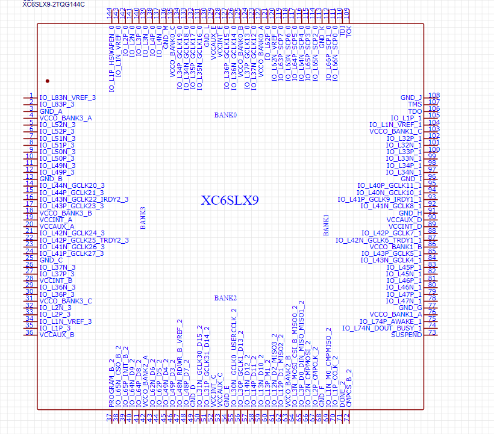
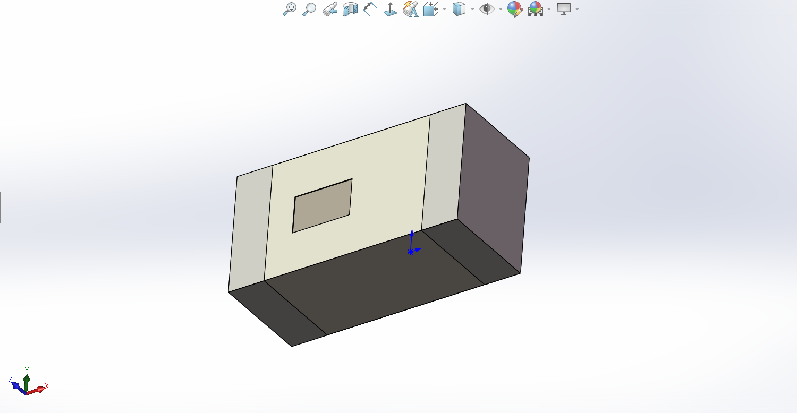

# Lazy-laying
## Overview
This project is aimed at helping electronics enthusiasts better handle the PCB layout, which is in great demand. After trying several software like Kicad, Altium Designer, Easyeda and so on, my difficulty with PCB layout remains still. Knowing little about the detail of each software's implementation, I start this project hoping to solve my problem. At least it's expected to complete the circuit of Version 2.0, which is an ultrasound-control circuit designed by me pinned on my GitHub page.

### Basic Knowledge
This part is aimed at concluding the basic knowledge of PCB design, having a system tree to organize all the functions. And the result can be concluded below:

|Item|Usage|Description|
|----|-----|-----------|
|Footprints|
|DSN|

---
- **Symbol**
  
    In circuit design, a symbol typically refers to the graphic representation of a circuit component, which is used to represent the function and connectivity of the component in a circuit diagram. These symbols are often simplified and standardized to ensure consistency and readability in circuit diagrams. Below is a symbol of XC6SLX9. Symbols are usually used in the schematic design. Thus it's not our focus.
    

- **Packages3D**
  
    Packages3D is used for creating three-dimensional packages for electronic components. In circuit design, Packages3D is often used to create 3D models of electronic components for use in PCB design and layout. Although Packages3D can help designers better understand the physical characteristics and spatial requirements of electronic components, enabling them to design circuit boards and layouts more effectively, it's seldom used when I place components. In [Kicad-packages3D-Github](https://github.com/KiCad/kicad-packages3D), you could see the files are saved as step and wrl, which could be opened by 3D modeling software. Below is an example.

- **Footprints**
  
    In circuit design, footprints refer to the layout and connectivity of electronic components on a Printed Circuit Board (PCB). Footprints are typically standardized graphic symbols used to represent the physical size and pin locations of electronic components for use in PCB design and layout. Footprints are a critical part of PCB design because they define the layout and connectivity of electronic components on the PCB. And that's what I searched for. While finishing the schematic design, most EDA software could generate the PCB files quickly. But the placement of components bothers me a lot. Actually what I did is merely drag the Footprints to better function and interface.

    So as we decide to use Footprints to have some work, the first problem come across that WHAT'S THE FILE TYPE OF FOOTPRINTS and HOW TO GET THE INFORMATION WE WANNA. Well, different EDA software usually has different file encoding formats and it's tough to generate a procedure to satisfy all the software. Thus I choose Kicad and EasyEDA, which present their Footprints in Kicad_mod and json.

    In Kicad, the Footprints are saved as Kicad_mod, and we could find some of them at https://github.com/KiCad/kicad-footprints. Fortunately, the kicad team provides a [dev-docs](https://dev-docs.kicad.org/en/build/) which helps a lot. In EasyEDA(standard), I tried to make a footprint but cannot save it as a dependent file, maybe all of its files including sch\pcb\symbols\footprints are set to be saved as json. JSON can be opened with a text editor and maybe I will learn it later.

- **DSN**
  
    In PCB design, the DSN file typically refers to the DesignSpark PCB software design file, which contains the entire PCB design information, including schematic, layout, footprint, net connections, rules, and constraints. And in kicad and EasyEDA, I could import DSN files to route automatical. And I wish to follow this rule to realize the placement of components rather than routing.
  
- **Attribution**
  
    First and foremost, we should realize that the information we got from FOOTPRINTS and DSN is far than enough. And that's what we have to establish to guarantee the replacement of components is reasonable. For example, the USB connector should be arranged at the edge of the board, which could be better connected when working.
    And what we have gained from FOOTPRINTS and DSN? 

### Documents Format in Kicad
KiCad uses an s-expression file format for symbol libraries, footprint libraries, schematics, printed circuit boards, and title block and border worksheets. We focused on the Footprints but I have to start to learn the S-EXPRESSION grammar. And related documents will be saved in another readme file.

### Function & Realize Path
**1. Able to classify the electron component**
> 

### Ideas
dsn

# License

This work is based on TAPR license, developed with open-source elements as much as possible.

Copyright QMZ432 (qmzs12345@gmail.com) 2023.

* The hardware is licensed under TAPR Open Hardware License (www.tapr.org/OHL)
* The software components are free software: you can redistribute it and/or modify it under the terms of the GNU General Public License as published by the Free Software Foundation, either version 3 of the License, or (at your option) any later version.
* The documentation is licensed under a [Creative Commons Attribution-ShareAlike 3.0 Unported License](http://creativecommons.org/licenses/by-sa/3.0/).